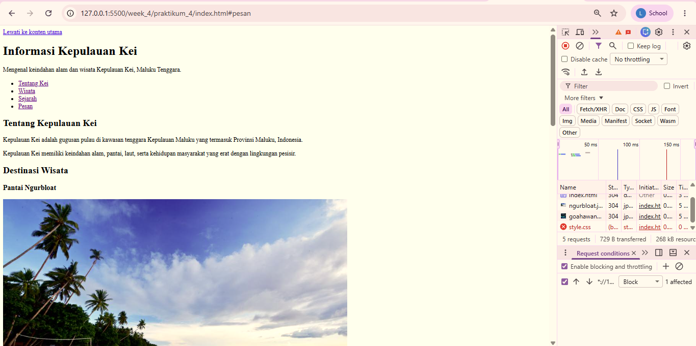
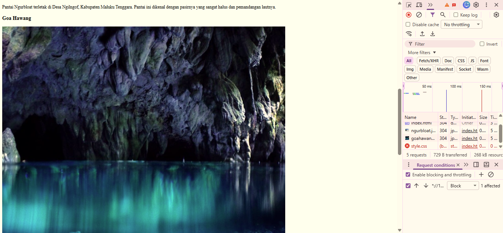
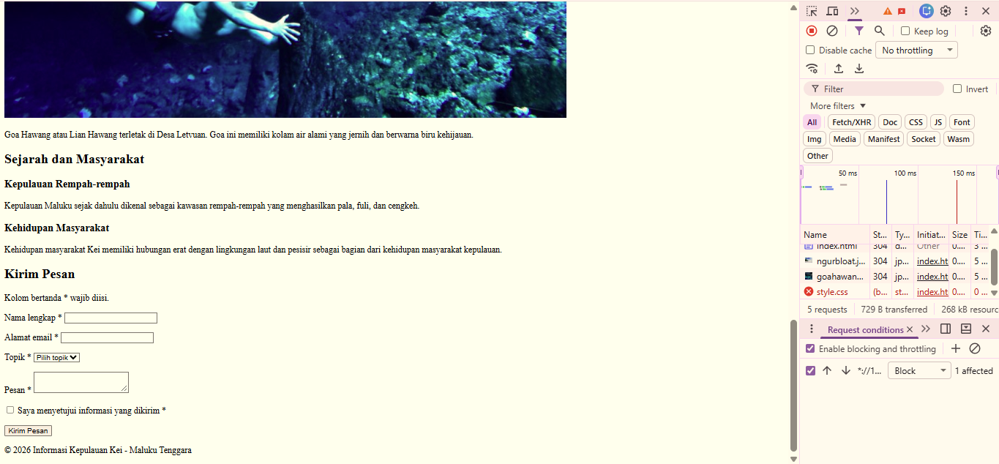
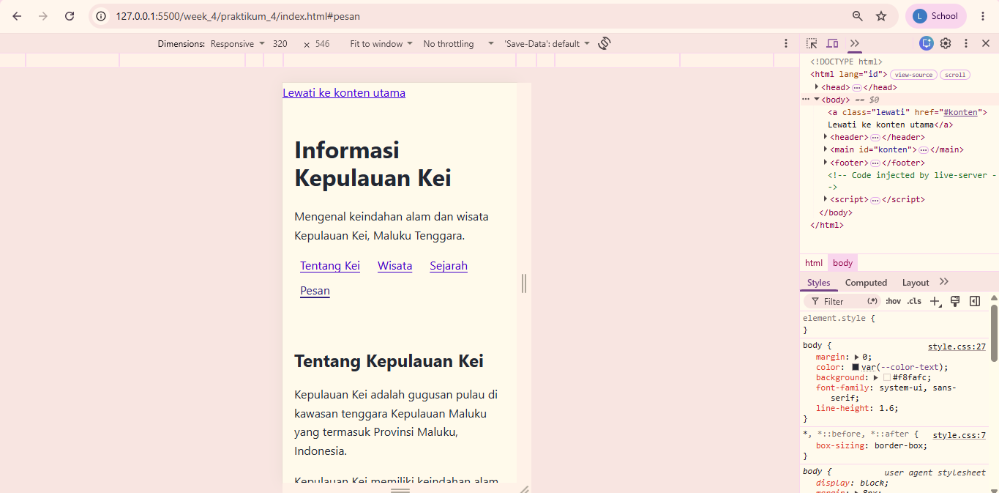
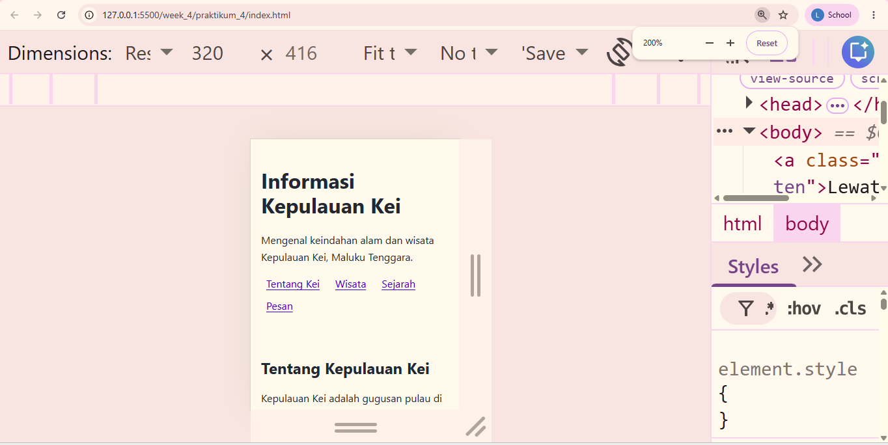

# EVIDENCE — Praktikum 4 Modern CSS Layout

## Identitas

* Nama: Leosudarso Welerubun
* Praktikum: Praktikum 4 — Modern CSS Layout
* Proyek: Informasi Kepulauan Kei

---

## B. Normal Flow

Style CSS dinonaktifkan sementara melalui DevTools untuk melihat urutan dokumen HTML tanpa bantuan CSS.

Hasil pengujian:

* Konten tetap dapat dibaca.
* Urutan konten mengikuti source order HTML.
* Header berada di bagian atas.
* Konten utama berada sebelum aside.
* Footer berada di bagian bawah.

### Bukti







---

## C. Navigation Flexbox

Navigation menggunakan Flexbox dengan `flex-wrap: wrap`.

Hasil pengujian:

* Link navigasi dapat berpindah ke baris berikutnya pada viewport sempit.
* Semua link tetap dapat digunakan.
* Navigasi dapat diakses menggunakan keyboard Tab.

### Bukti



---

## D. Main dan Aside

Layout utama menggunakan Flexbox untuk menempatkan `main` dan `aside`.

Hasil pengujian:

* Pada layar lebar, main dan aside dapat tampil berdampingan.
* Pada layar sempit, aside berpindah ke bawah.
* Tidak terjadi tumpang tindih atau konten terpotong.

---

## E. Flexible Layout

Layout menggunakan:

* `display: flex`
* `flex-wrap: wrap`
* `flex`
* `min-width: 0`

Hasil pengujian:

* Main dan aside menyesuaikan ukuran viewport.
* Layout tetap fleksibel ketika ukuran layar berubah.

---

## F. Card List

Bagian destinasi wisata menggunakan tiga card.

Hasil pengujian:

* Card menggunakan Flexbox.
* Card dapat berpindah baris ketika ruang tidak mencukupi.
* Tidak muncul horizontal scroll pada halaman utama.

---

## G. Positioned Badge

Satu card digunakan sebagai card unggulan dan memiliki badge **"Unggulan"**.

Teknik yang digunakan:

* Parent menggunakan `position: relative`.
* Badge menggunakan `position: absolute`.

Hasil pengujian:

* Badge tetap berada di dalam card.
* Badge tidak menutupi judul card.
* Badge tetap berada pada posisi yang sesuai ketika ukuran layar berubah.

---

## H. Media dan Teks Panjang

Media menggunakan:

```css
img,
video {
  max-width: 100%;
  height: auto;
}
```

Teks menggunakan `overflow-wrap: anywhere`.

Hasil pengujian:

* Gambar menyesuaikan lebar container.
* Teks panjang tidak menyebabkan halaman melebar.
* Elemen media tidak menyebabkan horizontal scroll pada halaman utama.

---

## I. Source Order

Source order HTML dipertahankan secara logis:

```text
header
main
aside
footer
```

Tidak menggunakan:

* `order`
* `row-reverse`
* `column-reverse`

Hasil pengujian:

* Urutan fokus keyboard mengikuti urutan visual.
* Tidak ada kontrol yang dilewati ketika menggunakan Tab.

---

## J. Reflow dan Narrow Viewport

Pengujian dilakukan menggunakan DevTools Device Toolbar pada viewport sempit.

Pengujian mencakup:

* Navigation
* Main content
* Aside
* Card
* Form
* Badge
* Zoom 200%

Hasil pengujian:

* Layout melakukan reflow dengan baik.
* Informasi dan fungsi tetap tersedia.
* Tidak terjadi horizontal scroll pada halaman utama.
* Konten tetap dapat digunakan pada viewport sempit.

### Bukti



---

## Kesimpulan

Praktikum 4 berhasil menerapkan konsep Modern CSS Layout menggunakan:

* Flexbox
* Flexible layout
* Flex wrapping
* Relative dan absolute positioning
* Responsive reflow
* Source order yang logis
* Pengelolaan overflow
* Pengujian viewport sempit
* Pengujian keyboard dan zoom
