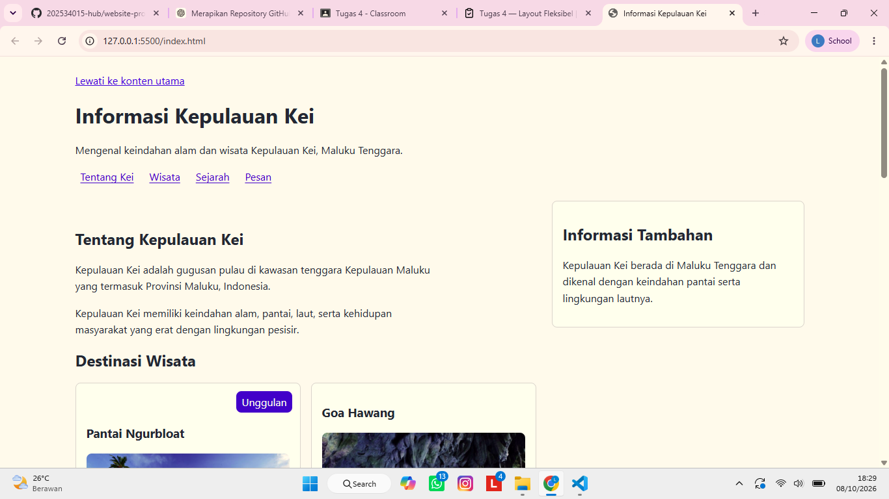
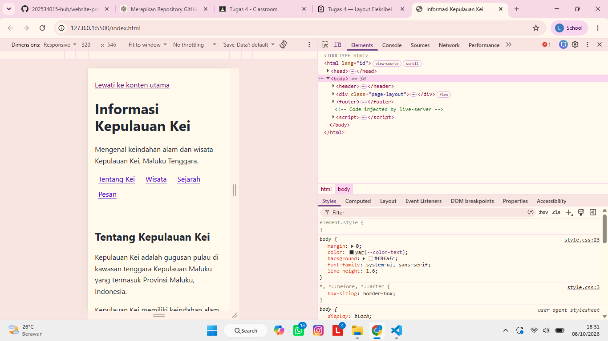
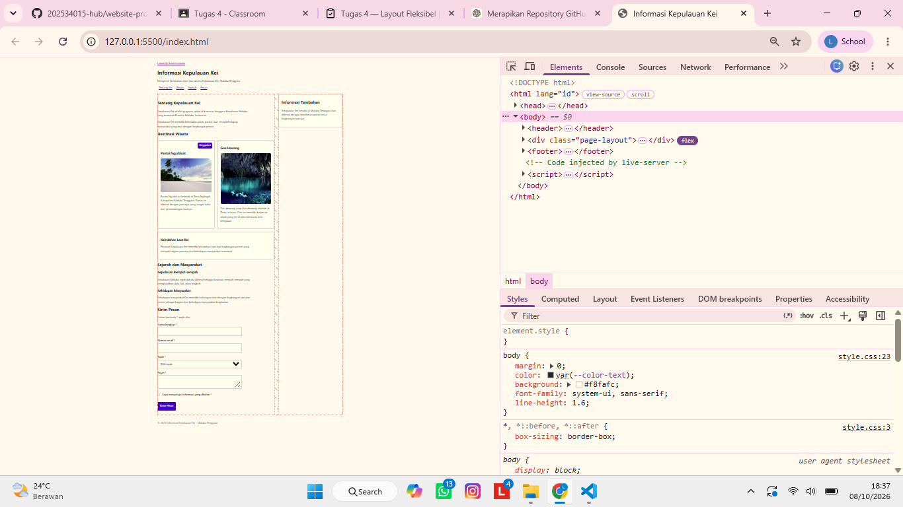

# EVIDENCE — Tugas 4 Layout Fleksibel

## 1. Informasi

**Nama:** Leo Sudarso Welerubun  
**Mata Kuliah:** Pemrograman Website  
**Praktikum:** Tugas 4 — Layout Fleksibel  
**Repository:** `website-programming-week-4`  
**Folder:** `tugas/`

---

## 2. Bukti 1 — Wide Viewport

Pada tampilan viewport lebar, halaman menampilkan:

- Navigasi menggunakan Flexbox.
- `main` dan `aside` berada berdampingan.
- Tiga card tersusun secara fleksibel.
- Badge "Unggulan" berada di dalam card unggulan.
- Tidak terdapat horizontal scroll pada konten utama.



---

## 3. Bukti 2 — Narrow Viewport

Pengujian dilakukan pada viewport sekitar **320 CSS px**.

Hasil pengujian:

- `main` dan `aside` berubah menjadi satu kolom.
- Card berubah menjadi satu kolom.
- Navigasi dapat melakukan wrapping.
- Konten tetap berada di dalam viewport.
- Tidak terdapat horizontal scroll pada konten utama.



---

## 4. Bukti 3 — Flexbox Overlay

DevTools digunakan untuk melihat Flexbox overlay pada container layout.

Container yang diperiksa adalah `.page-layout`.

Pengujian menunjukkan bahwa:

- `.page-layout` menggunakan `display: flex`.
- Container menggunakan `flex-wrap: wrap`.
- Jarak antar-item menggunakan `gap`.
- `main` dan `aside` merupakan flex item.
- Saat ruang tidak mencukupi, item dapat melakukan reflow.



---

## 5. Bukti 4 — Badge pada Zoom 200%

Pengujian dilakukan menggunakan browser dengan tingkat zoom **200%**.

Hasil pengujian:

- Badge tetap berada pada posisi yang benar.
- Badge tidak menutupi judul card.
- Card tetap berada dalam layout.
- Tidak terjadi kerusakan posisi elemen.

Badge menggunakan kombinasi:

```css
.card--featured {
  position: relative;
}

.badge {
  position: absolute;
}

6. Bukti 5 — Pengujian Keyboard

Pengujian keyboard dilakukan menggunakan tombol Tab untuk memastikan fokus berpindah secara logis.

Hal yang diperiksa:

Fokus keyboard terlihat dengan jelas.
Urutan fokus mengikuti struktur dokumen.
Link navigasi dapat menerima fokus.
Input form dapat menerima fokus.
Tombol dapat menerima fokus.
Tidak ada elemen interaktif yang dilewati secara tidak logis.

Bukti berupa rangkaian screenshot pengujian keyboard akan ditambahkan setelah seluruh pengujian keyboard selesai dilakukan.

7. Pengujian Responsive dan Overflow

Salah satu masalah yang ditemukan pada proses penyempurnaan layout adalah penggunaan ukuran card yang kurang sesuai dengan sistem Flexbox.

Perbaikan yang dilakukan:

Menghapus width: 100% pada .card.
Menggunakan flex: 1 1 16rem pada card.
Menggunakan gap sebagai pengatur jarak antar-card.
Menambahkan min-width: 0 pada flex item.
Memastikan gambar menggunakan max-width: 100%.
Memastikan teks panjang dapat melakukan wrapping.

CSS yang digunakan:

.card-list {
  display: flex;
  flex-wrap: wrap;
  gap: var(--space-2);
}

.card-list > .card {
  flex: 1 1 16rem;
  min-width: 0;
}

.card {
  min-width: 0;
  overflow: hidden;
}

Perbaikan tersebut membuat card dapat menyesuaikan ruang yang tersedia tanpa menyebabkan horizontal overflow pada layout utama.

8. Source Order

Struktur HTML tetap mengikuti urutan sumber dokumen.

Tidak digunakan:

order
flex-direction: row-reverse
flex-direction: column-reverse
float untuk layout utama.

Urutan konten tetap mengikuti struktur HTML sehingga urutan visual dan struktur dokumen tetap konsisten.

9. Layout Main dan Aside

Layout utama menggunakan Flexbox:

.page-layout {
  display: flex;
  flex-wrap: wrap;
  gap: var(--space-3);
}

main menggunakan ukuran fleksibel:

.page-layout > main {
  flex: 1 1 36rem;
  min-width: 0;
}

aside juga menggunakan ukuran fleksibel:

.page-layout > aside {
  flex: 1 1 16rem;
  min-width: 0;
}

Pada viewport lebar, kedua elemen dapat berada berdampingan.

Pada viewport sempit, keduanya berubah menjadi satu kolom melalui media query.

10. Card Layout

Daftar card menggunakan Flexbox:

.card-list {
  display: flex;
  flex-wrap: wrap;
  gap: var(--space-2);
}

Setiap card menggunakan:

.card-list > .card {
  flex: 1 1 16rem;
  min-width: 0;
}

Dengan pengaturan tersebut, tiga card dapat menyesuaikan ukuran ruang yang tersedia.

11. Badge Positioning

Badge pada card unggulan menggunakan positioning.

Parent:

.card--featured {
  position: relative;
}

Badge:

.badge {
  position: absolute;
  inset-block-start: 0.75rem;
  inset-inline-end: 0.75rem;
}

position: relative pada card digunakan sebagai acuan posisi untuk elemen badge yang menggunakan position: absolute.

Padding bagian atas card juga diperbesar agar badge tidak menutupi judul:

.card--featured {
  padding-block-start: 3rem;
}
12. Navigasi Flexbox

Navigasi menggunakan Flexbox dan dapat melakukan wrapping:

.nav-list {
  display: flex;
  flex-wrap: wrap;
  gap: var(--space-1);
}

Penggunaan flex-wrap: wrap memungkinkan link navigasi berpindah ke baris berikutnya ketika ruang horizontal tidak mencukupi.

13. Media dan Konten Responsif

Gambar dibuat responsif menggunakan:

img,
video {
  max-width: 100%;
  height: auto;
}

Gambar pada card juga menggunakan:

.card img {
  display: block;
  width: 100%;
  max-width: 100%;
  height: auto;
}

Dengan demikian, media tidak melebihi batas container.

Teks panjang juga diberikan aturan:

a,
p {
  overflow-wrap: anywhere;
}
14. Responsive Reflow

Media query digunakan untuk mengubah layout ketika viewport menjadi sempit:

@media (max-width: 48rem) {
  .page-layout > main,
  .page-layout > aside {
    flex-basis: 100%;
  }

  .card-list > .card {
    flex-basis: 100%;
  }
}

Hasilnya:

main dan aside menjadi satu kolom.
Card menjadi satu kolom.
Konten tetap dapat dibaca pada layar sempit.
15. Keyboard Focus

Indikator fokus tetap dipertahankan menggunakan :focus-visible.

Contoh:

.nav-link:focus-visible {
  outline: 3px solid var(--color-focus);
  outline-offset: 3px;
}

Elemen form dan tombol juga memiliki indikator fokus:

input:focus-visible,
textarea:focus-visible,
select:focus-visible,
button:focus-visible {
  outline: 3px solid var(--color-focus);
  outline-offset: 3px;
}

Hal ini membantu pengguna keyboard mengetahui elemen yang sedang mendapatkan fokus.

16. Struktur Semantik

Struktur HTML tetap menggunakan elemen semantik seperti:

<header>
<nav>
<main>
<article>
<section>
<aside>
<form>
<footer>

Struktur tersebut dipertahankan agar layout fleksibel tidak menghilangkan struktur semantik yang sudah dibuat pada praktikum sebelumnya.

17. Pengujian Tambahan

Pengujian yang dilakukan atau akan dilakukan:

Wide viewport.
Viewport sekitar 320 CSS px.
Flexbox overlay menggunakan DevTools.
Zoom browser 200%.
Pengujian keyboard menggunakan tombol Tab.
Pemeriksaan horizontal overflow.
Pemeriksaan Console DevTools.
Pemeriksaan Network DevTools.
Pemeriksaan validitas HTML menggunakan Nu HTML Checker.

Hasil pengujian tambahan akan dilengkapi setelah seluruh pemeriksaan selesai.

18. Git History

Bukti git log --oneline akan ditambahkan setelah seluruh proses commit selesai.

Perintah yang digunakan:

git log --oneline

Bukti screenshot hasil Git history akan digunakan untuk menunjukkan proses pengerjaan dan jumlah commit.

19. Kesimpulan

Tugas 4 menggunakan Flexbox sebagai dasar layout fleksibel.

Implementasi utama meliputi:

Flexbox pada navigasi.
Flexbox pada layout main dan aside.
Flexbox pada daftar card.
flex-wrap untuk responsive reflow.
gap untuk jarak antar-elemen.
flex-basis untuk ukuran fleksibel.
min-width: 0 untuk membantu mencegah overflow.
position: relative dan position: absolute untuk badge.
Responsive media.
Visual order mengikuti source order.
Tidak menggunakan order, reverse layout, atau float untuk layout utama.
Indikator keyboard focus tetap dipertahankan.